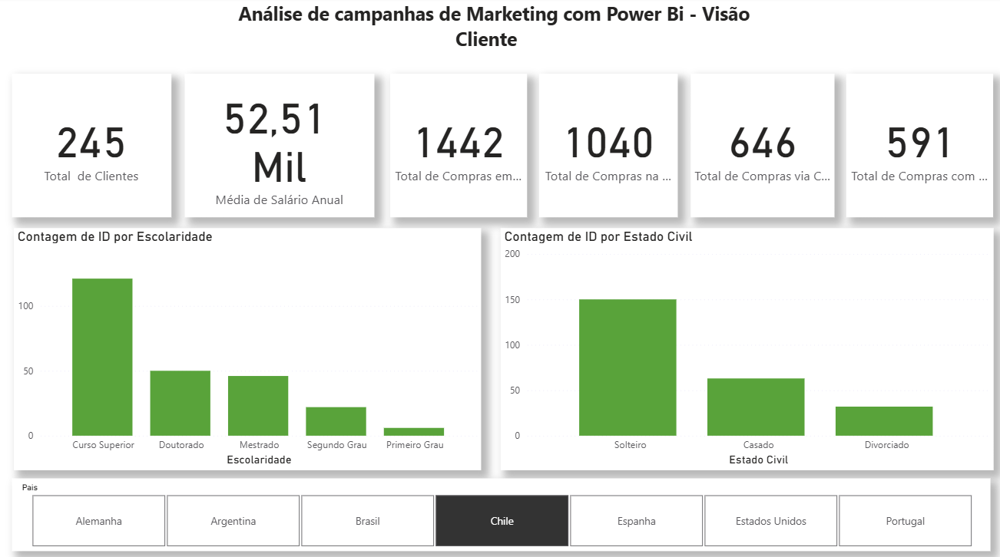
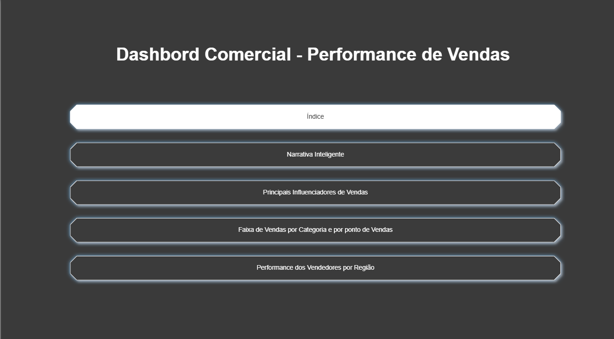
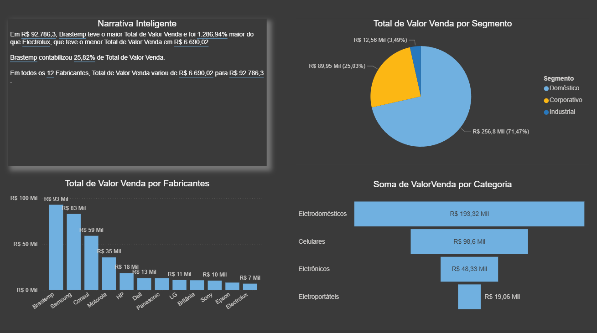
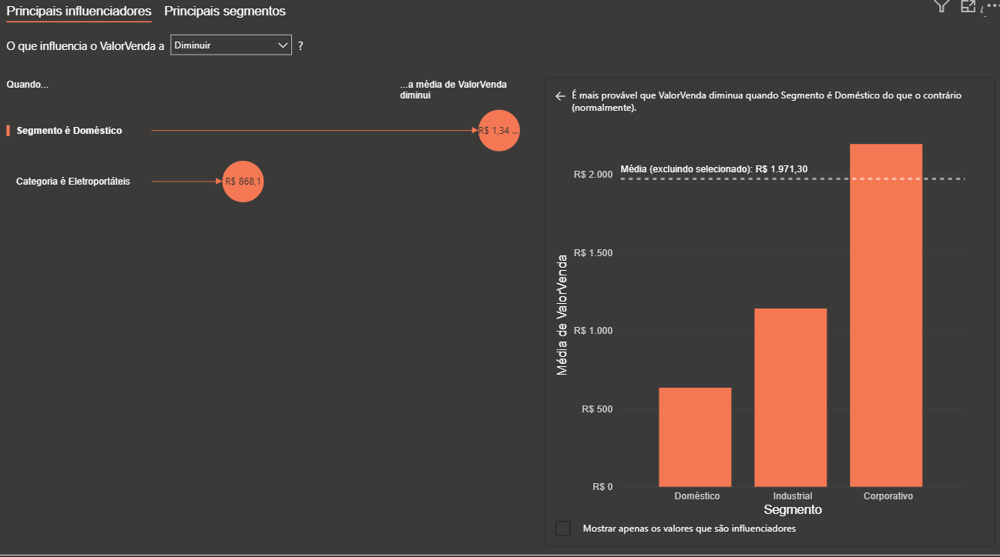
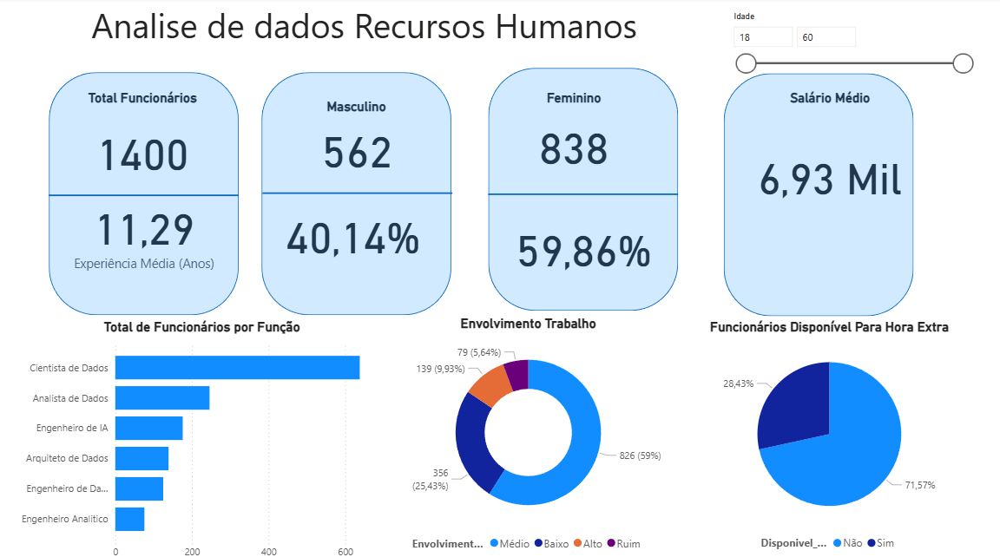

# 👩‍💻 Portfólio de Análise de Dados

Bem-vindo(a) ao meu portfólio de projetos em **Análise de Dados**!  
Aqui você encontrará alguns dashboards que desenvolvi no **Power BI**, com foco em transformar dados em informações úteis para apoiar decisões estratégicas.  

---

## 📊 Projetos em Power BI

### 1. Dashboard de Marketing
- **Objetivo:** Criar uma Visão Cliente, Visão Comportamento, Visão Campanhas e Visão Ponto de Vendas.  
- **Principais insights:**  
  - Top 5 produtos mais lucrativos  
  - Comparativo de metas x realizado  
  - Tendência de crescimento em regiões específicas  
- 🔗 [Acesse o dashboard interativo](#) *(substitua com o link do Power BI Service)*  
- 📸  

---

### 2. Dashboard Comercial
- **Objetivo:** Fornecer uma visão consolidada da performance comercial, acompanhando resultados por região, equipe e produto.  
- **Principais insights:**  
  - Comparativo de metas x realizado  
  - Top clientes por faturamento  
  - Performance de equipes de vendas por região  
- 🔗 [Acesse o dashboard interativo](#) *(substitua com o link do Power BI Service)*  
- 
- 
- 
  

---

### 3. Dashboard de Recursos Humanos
- **Objetivo:** Monitorar indicadores de RH para apoiar a gestão de pessoas.  
- **Principais insights:**  
  - Taxa de rotatividade  
  - Tempo médio de permanência dos colaboradores  
  - Contratações x desligamentos ao longo do tempo  
- 🔗 [Acesse o dashboard interativo](#)  
-   

---

## 🛠️ Habilidades Técnicas
- **Power BI**: ETL, DAX, visualizações interativas  
- **Excel Avançado**: Tabelas dinâmicas, fórmulas e gráficos  
- **SQL**: consultas básicas para análise de dados  
- **Análise de KPIs**: vendas, finanças e recursos humanos  

---

## 📬 Contato
- **LinkedIn:** [https://www.linkedin.com/in/larissa-tarcisio-a90461182/](#)  
- **E-mail:** [larissa_tarcisio@hotmail.com](#)  

---
✦ Desenvolvido por [Larissa Tarcisio]
